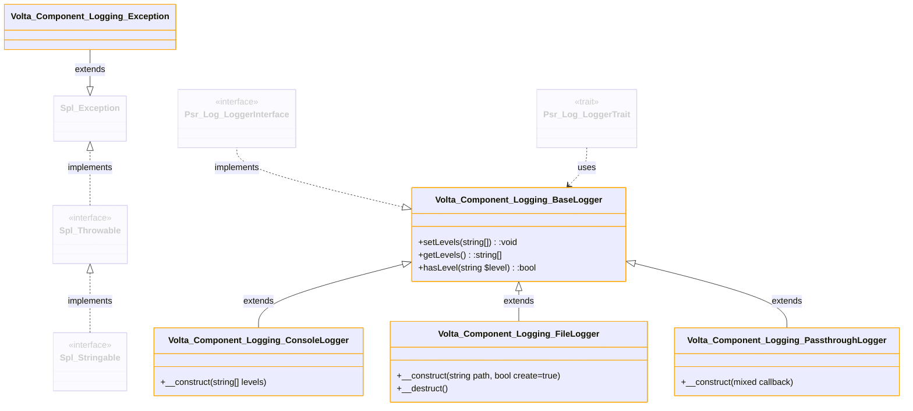

- For the (UML)Domain model see [the README in the main folder](./README.md)
- To see the loggers in action see [the README in the public folder](./public/README.md)
- For more details see [the README in the libraries folder](./libraries/README.md)

# Volta Component Logging

Component used for logging information.

The component is based on the Psr\Log Interfaces. For more information about these interfaces see https://www.php-fig.org/psr/psr-3/.

 

 