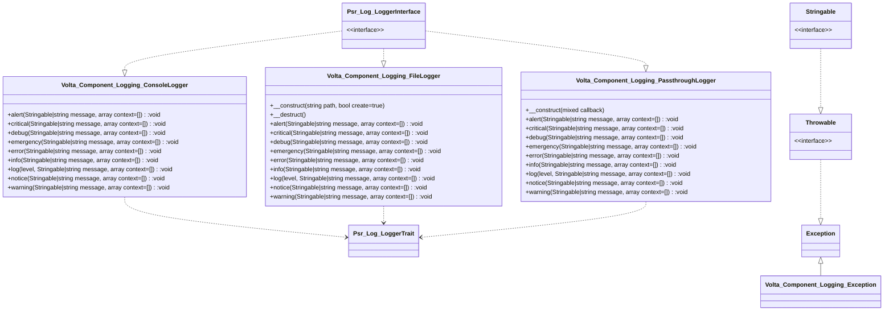

[//]: # (Start Quadro\UmlDoc\MermaidDiagram)

[//]: # (End Quadro\UmlDoc\MermaidDiagram)
[//]: # (Start Quadro\UmlDoc\MdDiagram)

Generated @  20230619 13:50:49

# Volta\Component\Logging\
4 Classes, 0 Interfaces, 0 Traits, 0 Enums,
### [Volta\Component\Logging\ConsoleLogger](#) *implements* Psr\Log\LoggerInterface
 The Console logger will send the log entries to the console if available. This means if STDOUT is available of
 when we are running the PHP build in webserver. In the latter case we send the log entry to the error_log which
 is printed to the console. In all other cases the entry is ignored
#### Methods(9)
- public function **[alert](#)(Stringable|string message, array context=[])**: void\
&rdsh; *Action must be taken immediately.*\
&nbsp;&nbsp; \
&nbsp;&nbsp; *Example: Entire website down, database unavailable, etc. This should*\
&nbsp;&nbsp; *trigger the SMS alerts and wake you up.*
- public function **[critical](#)(Stringable|string message, array context=[])**: void\
&rdsh; *Critical conditions.*\
&nbsp;&nbsp; \
&nbsp;&nbsp; *Example: Application component unavailable, unexpected exception.*
- public function **[debug](#)(Stringable|string message, array context=[])**: void\
&rdsh; *Detailed debug information.*
- public function **[emergency](#)(Stringable|string message, array context=[])**: void\
&rdsh; *System is unusable.*
- public function **[error](#)(Stringable|string message, array context=[])**: void\
&rdsh; *Runtime errors that do not require immediate action but should typically*\
&nbsp;&nbsp; *be logged and monitored.*
- public function **[info](#)(Stringable|string message, array context=[])**: void\
&rdsh; *Interesting events.*\
&nbsp;&nbsp; \
&nbsp;&nbsp; *Example: User logs in, SQL logs.*
- public function **[log](#)( level, Stringable|string message, array context=[])**: void\
&rdsh; *The log entries are made colorfully before send to the console.*
- public function **[notice](#)(Stringable|string message, array context=[])**: void\
&rdsh; *Normal but significant events.*
- public function **[warning](#)(Stringable|string message, array context=[])**: void\
&rdsh; *Exceptional occurrences that are not errors.*\
&nbsp;&nbsp; \
&nbsp;&nbsp; *Example: Use of deprecated APIs, poor use of an API, undesirable things*\
&nbsp;&nbsp; *that are not necessarily wrong.*
### [Volta\Component\Logging\Exception](#) : Exception *implements* Throwable, Stringable
### [Volta\Component\Logging\FileLogger](#) *implements* Psr\Log\LoggerInterface
#### Methods(11)
- public function **[__construct](#)(string path, bool create=true)**:
- public function **[__destruct](#)()**:
- public function **[alert](#)(Stringable|string message, array context=[])**: void\
&rdsh; *Action must be taken immediately.*\
&nbsp;&nbsp; \
&nbsp;&nbsp; *Example: Entire website down, database unavailable, etc. This should*\
&nbsp;&nbsp; *trigger the SMS alerts and wake you up.*
- public function **[critical](#)(Stringable|string message, array context=[])**: void\
&rdsh; *Critical conditions.*\
&nbsp;&nbsp; \
&nbsp;&nbsp; *Example: Application component unavailable, unexpected exception.*
- public function **[debug](#)(Stringable|string message, array context=[])**: void\
&rdsh; *Detailed debug information.*
- public function **[emergency](#)(Stringable|string message, array context=[])**: void\
&rdsh; *System is unusable.*
- public function **[error](#)(Stringable|string message, array context=[])**: void\
&rdsh; *Runtime errors that do not require immediate action but should typically*\
&nbsp;&nbsp; *be logged and monitored.*
- public function **[info](#)(Stringable|string message, array context=[])**: void\
&rdsh; *Interesting events.*\
&nbsp;&nbsp; \
&nbsp;&nbsp; *Example: User logs in, SQL logs.*
- public function **[log](#)( level, Stringable|string message, array context=[])**: void
- public function **[notice](#)(Stringable|string message, array context=[])**: void\
&rdsh; *Normal but significant events.*
- public function **[warning](#)(Stringable|string message, array context=[])**: void\
&rdsh; *Exceptional occurrences that are not errors.*\
&nbsp;&nbsp; \
&nbsp;&nbsp; *Example: Use of deprecated APIs, poor use of an API, undesirable things*\
&nbsp;&nbsp; *that are not necessarily wrong.*
### [Volta\Component\Logging\PassthroughLogger](#) *implements* Psr\Log\LoggerInterface
 This Logger will pass the log entry to the given callback
#### Methods(10)
- public function **[__construct](#)(mixed callback)**:
- public function **[alert](#)(Stringable|string message, array context=[])**: void\
&rdsh; *Action must be taken immediately.*\
&nbsp;&nbsp; \
&nbsp;&nbsp; *Example: Entire website down, database unavailable, etc. This should*\
&nbsp;&nbsp; *trigger the SMS alerts and wake you up.*
- public function **[critical](#)(Stringable|string message, array context=[])**: void\
&rdsh; *Critical conditions.*\
&nbsp;&nbsp; \
&nbsp;&nbsp; *Example: Application component unavailable, unexpected exception.*
- public function **[debug](#)(Stringable|string message, array context=[])**: void\
&rdsh; *Detailed debug information.*
- public function **[emergency](#)(Stringable|string message, array context=[])**: void\
&rdsh; *System is unusable.*
- public function **[error](#)(Stringable|string message, array context=[])**: void\
&rdsh; *Runtime errors that do not require immediate action but should typically*\
&nbsp;&nbsp; *be logged and monitored.*
- public function **[info](#)(Stringable|string message, array context=[])**: void\
&rdsh; *Interesting events.*\
&nbsp;&nbsp; \
&nbsp;&nbsp; *Example: User logs in, SQL logs.*
- public function **[log](#)( level, Stringable|string message, array context=[])**: void\
&rdsh; *The log entries are passed through the callback.*
- public function **[notice](#)(Stringable|string message, array context=[])**: void\
&rdsh; *Normal but significant events.*
- public function **[warning](#)(Stringable|string message, array context=[])**: void\
&rdsh; *Exceptional occurrences that are not errors.*\
&nbsp;&nbsp; \
&nbsp;&nbsp; *Example: Use of deprecated APIs, poor use of an API, undesirable things*\
&nbsp;&nbsp; *that are not necessarily wrong.*

[//]: # (End Quadro\UmlDoc\MdDiagram)
