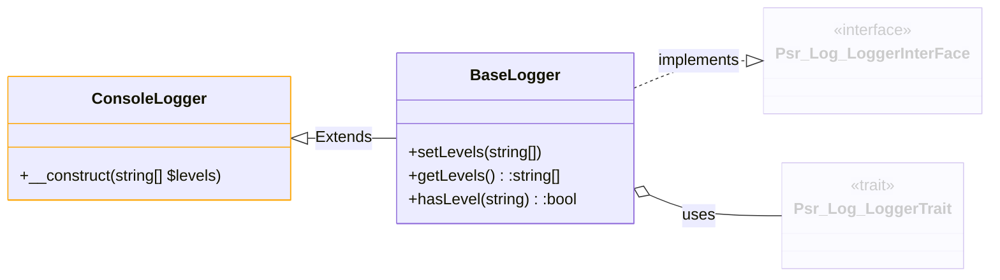
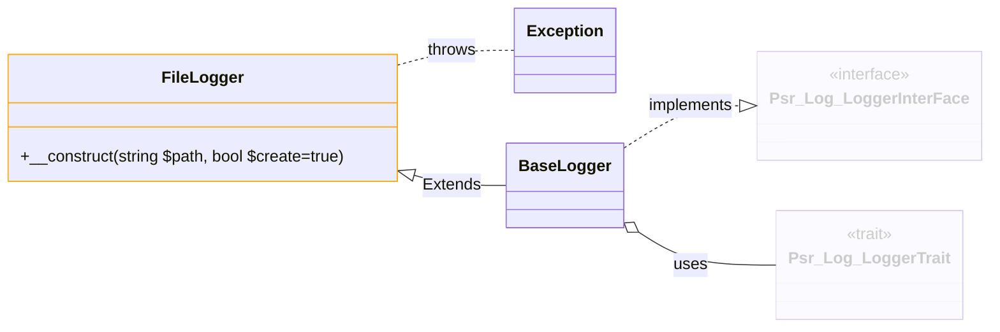
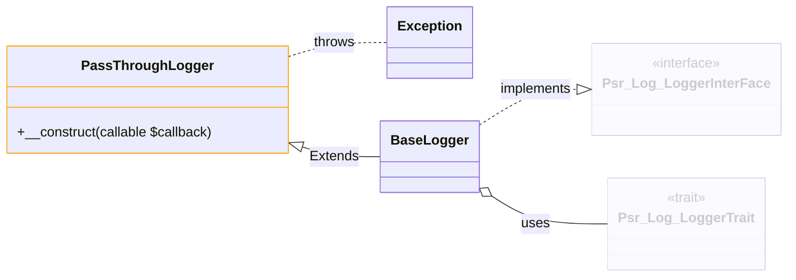
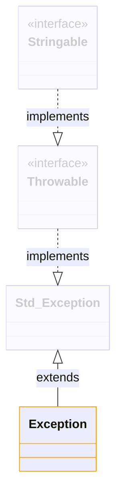

- For the (UML)Domain model see [the README in the main folder](./../README.md)
- To see the loggers in action see [the README in the public folder](./../public/README.md)
- For more details see [the README in the libraries folder](./README.md)

# Volta\Component\Logging

This component is based on the Psr\Log Interfaces. For more information about these interfaces see https://www.php-fig.org/psr/psr-3/.

We added the functionality to choose which log levels should be added to the log. If no levels are specified all the levels are logged. When the list with levels is set with `BaseLogger->setLevels()` only the levels present in this list will be logged.

Example:
```php

$logger = new \Volta\Component\Logging\ConsoleLogger(['Debug', 'Critical']);
$logger->warning('This will NOT be logged.');
$logger->debug('But this will');

$logger = new \Volta\Component\Logging\FileLogger('path-to-log-file.log');
$logger->setLevels(['Debug', 'Critical']);
$logger->warning('This will NOT be logged.');
$logger->debug('But this will');

```

 
The Logging component counts 5 classes all in the namespace *Volta\Component\Logging*:

1. Volta\Component\Logging\BaseLogger
2. Volta\Component\Logging\ConsoleLogger
3. Volta\Component\Logging\FileLogger
4. Volta\Component\Logging\PassThroughLogger
5. Volta\Component\Logging\Exception

## ~\ConsoleLogger

The Console logger will send the log entries to the console if available. This means if the constant **STDOUT** is available. When we are running the PHP build in webserver, we send the log entry to the **error_log** which in turn is printed to the console. In all other cases, the entry is ignored. Mostly used for debugging.



## ~\FileLogger

The File logger will append the log entries to a file. The file is set when the Log is instantiated. An exception is thrown when the file is invalid.



## ~\PassThroughLogger

This Logger will pass the log entry to the given (valid)callback. The callback is set when the Log is instantiated. Throw an Exception when an invalid callback is passed. 



## ~\Exception

Basic Exception for all exceptions thrown in this Component.

